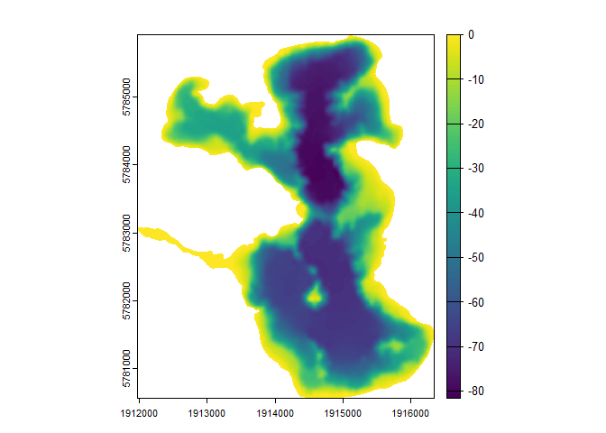

<!-- README.md is generated from README.Rmd. Please edit that file -->

# bathytools

<!-- badges: start -->

[](https://app.codecov.io/gh/limnotrack/bathytools)
[](https://github.com/limnotrack/bathytools/actions/workflows/R-CMD-check.yaml)
<!-- badges: end -->

The goal of bathytools is to facilitate the generation of bathymetric
data for lakes and reservoirs. The package provides functions to
generate depth points from bathymetric data, and to rasterise these
points into a bathymetric raster. The package is designed to work with
data from the AEME project, but can be used with any bathymetric data.

## Installation

You can install the development version of bathytools from
[GitHub](https://github.com/) with:

``` r
# install.packages("pak")
pak::pak("limnotrack/bathytools")
```

## Example

This is a basic example which shows you how to solve a common problem:

``` r
library(bathytools)
## basic example code
shoreline <- readRDS(system.file("extdata/rotoma_shoreline.rds",
                                 package = "bathytools"))
point_data <- readRDS(system.file("extdata/depth_points.rds",
                                  package = "bathytools"))
bathy <- rasterise_bathy(shoreline = shoreline, point_data = point_data,
                         crs = 2193)
#> Generating depth points... [2024-09-17 18:51:59]
#> Finished! [2024-09-17 18:52:00]
#> Interpolating to raster... [2024-09-17 18:52:00]
#> Finished! [2024-09-17 18:52:24]
```


