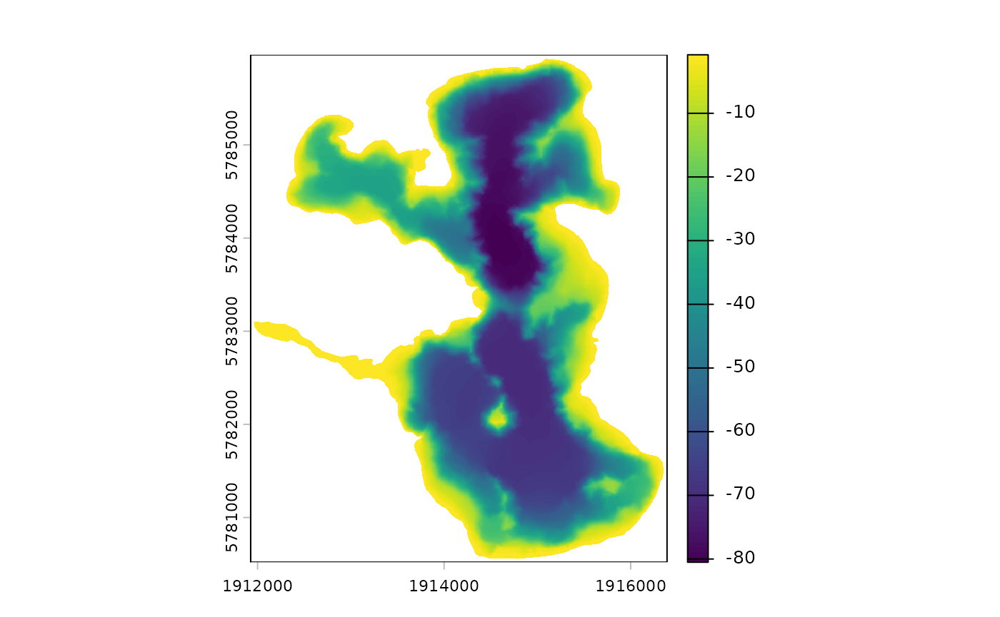
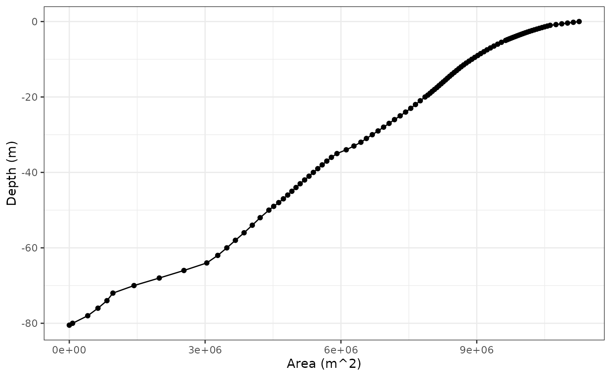
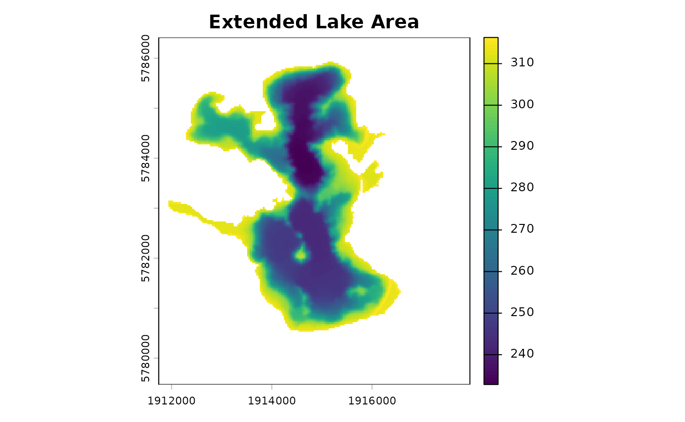
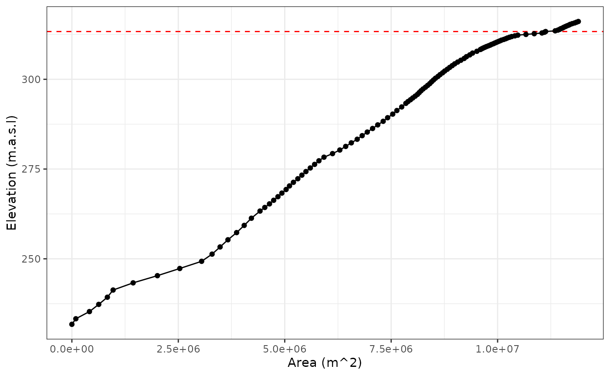

# Merge Bathymetry with DEM data

Lake bathymetry data is useful for a range of applications, including
habitat mapping, water quality monitoring, and hydrodynamic modelling.
However, lakes sit within a landscape, and it is often useful to know
how the bathymetry data relates to the surrounding topography. This is
particularly important for hydrodynamic modelling of lakes with large
fluctuations in water level, or for flood risk assessments in the
surrounding area.

This vignette demonstrates how to merge bathymetry data with a Digital
Elevation Model (DEM) raster using the
[`merge_bathy_dem()`](https://limnotrack.github.io/bathytools/reference/merge_bathy_dem.md)
function.

## Load the data

We will use the bathytools package to merge bathymetry data with a DEM
raster. The package includes example data for Lake Rotoma, New Zealand.
The bathymetry data is stored as a XYZ data.frame in an .rds file within
the package. Whereas the DEM data is stored as a raster in a [TIF
file](https://en.wikipedia.org/wiki/TIFF). The DEM raster was prepared
from LiDAR data provided by [Land Information New
Zealand](https://www.linz.govt.nz/) and can be downloaded
[here](https://data.linz.govt.nz/layer/105690-bay-of-plenty-lidar-1m-dem-2019-2022/).

We will also use a shapefile of the lake shoreline and a shapefile of
the lake catchment. These were both sourced from the [Freshwater
Ecosytems of New
Zealand](https://www.doc.govt.nz/our-work/freshwater-ecosystems-of-new-zealand/)
database.

``` r
library(bathytools)
library(tmap) # Used for plotting spatial data
```

``` r
shoreline <- readRDS(system.file("extdata/rotoma_shoreline.rds",
                                 package = "bathytools"))
catchment <- readRDS(system.file("extdata/rotoma_catchment.rds",
                                   package = "bathytools"))
```

The example lake we will be looking at is Lake Rotoma in the Bay of
Plenty Region on the North Island of Aotearoa New Zealand. The lake is a
popular recreational spot for fishing and boating.

The [tmap](https://r-tmap.github.io/tmap/) package is used to plot
spatial data. The `tmap_mode("view")` function is used to display the
map in the viewer pane in RStudio. The
`tmap_options(basemaps = "Esri.WorldImagery")` function is used to set
the basemap to a satellite image. It is similar to the `ggplot2`
package, but is specifically designed for spatial data. Here we plot the
lake shoreline in light blue and the lake catchment in pink.

``` r
tmap_mode("view")
#> ℹ tmap modes "plot" - "view"
#> ℹ toggle with `tmap::ttm()`
tmap_options(basemap.server = "Esri.WorldImagery")

tm_shape(shoreline) +
  tm_borders(col = "#8DA0CB", lwd = 2) +
  tm_shape(catchment) +
  tm_borders(col = "#E78AC3", lwd = 2) 
```

The depth data is stored in XYZ format, with the x and y coordinates
representing the location of the depth point, and the z coordinate
representing the depth in meters. The depth data is stored as a
data.frame in an .rds file within the package. Here we show the first
few rows of the depth data.

``` r
point_data <- readRDS(system.file("extdata/depth_points.rds",
                                  package = "bathytools"))
head(point_data)
#>        lon       lat  depth
#> 1 176.5952 -38.03974  -3.88
#> 2 176.5853 -38.03590 -79.90
#> 3 176.5904 -38.03109 -63.30
#> 4 176.5960 -38.06580  -5.06
#> 5 176.5790 -38.03500 -38.51
#> 6 176.5691 -38.02957 -20.06
```

``` r
dem_raster <- terra::rast(system.file("extdata/dem_32m.tif",
                                      package = "bathytools"))
tm_shape(dem_raster) +
  tm_raster(col_alpha = 0.5, col.scale = tm_scale_continuous(values = "-brewer.yl_gn_bu")) +
  tm_shape(shoreline) +
  tm_borders(col = "#FC8D62", lwd = 2) +
  tm_shape(catchment) +
  tm_borders(col = "#A6D854", lwd = 2) 
#> Warning: tm_scale_intervals `label.style = "continuous"` implementation in view mode
#> work in progress
```

## Generate the bathymetry raster

The first step is to generate a bathymetry raster from the shoreline and
depth data. The
[`rasterise_bathy()`](https://limnotrack.github.io/bathytools/reference/rasterise_bathy.md)
function is used to generate the bathymetry raster. The function takes
the shoreline, depth data, and the coordinate reference system (CRS) as
inputs. The function returns a `SpatRaster` object representing the
bathymetry raster.

``` r

bathy_raster <- rasterise_bathy(shoreline = shoreline,
                                depth_points = point_data, crs = 2193,
                                res = 8)
#> Generating depth points... [2026-03-09 21:28:07]
#> Finished! [2026-03-09 21:28:07]
#> Interpolating to raster... [2026-03-09 21:28:07]
#> Adjusting depths >= 0 to  -0.81 m
#> Finished! [2026-03-09 21:28:26]
```



``` r
tm_shape(dem_raster) +
  tm_raster(col_alpha = 0.5, 
            col.scale = tm_scale_continuous(values = "-brewer.yl_gn_bu")) +
  tm_shape(bathy_raster) +
  tm_raster(col.scale = tm_scale_continuous(values = "-viridis", ticks = seq(-90, 0, by = 10))) +
  tm_shape(shoreline) +
  tm_borders(col = "#FC8D62", lwd = 2) +
  tm_shape(catchment) +
  tm_borders(col = "#A6D854", lwd = 2) 
#> Warning: tm_scale_intervals `label.style = "continuous"` implementation in view mode
#> work in progress
#> tm_scale_intervals `label.style = "continuous"` implementation in view mode
#> work in progress
```

## Merge the bathymetry with the DEM

The next step is to merge the bathymetry raster with the DEM raster. The
[`merge_bathy_dem()`](https://limnotrack.github.io/bathytools/reference/merge_bathy_dem.md)
function is used to merge the bathymetry raster with the DEM raster. The
function takes the shoreline, bathymetry raster, DEM raster, and
catchment shapefile as inputs. The function returns a `SpatRaster`
object representing the merged bathymetry and DEM data.

If the resolution of the bathymetry raster is different from the DEM
raster, the bathymetry raster will be resampled to match the resolution
of the DEM raster.

``` r

dem_bath <- merge_bathy_dem(shoreline = shoreline, bathy_raster = bathy_raster,
                            dem_raster = dem_raster, catchment = catchment)
#> Resolutions differ. Resampling bathy_raster to DEM resolution.
#> Lake surface elevation from DEM: 313.3 m
dem_bath
#> class       : SpatRaster 
#> size        : 217, 194, 1  (nrow, ncol, nlyr)
#> resolution  : 32, 32  (x, y)
#> extent      : 1911744, 1917952, 5779472, 5786416  (xmin, xmax, ymin, ymax)
#> coord. ref. : NZGD2000 / New Zealand Transverse Mercator 2000 (EPSG:2193) 
#> source(s)   : memory
#> varname     : dem_32m 
#> name        : elevation 
#> min value   :  232.8289 
#> max value   :  599.1376
```

### Spatial plot of the merged raster

Here we plot the merged raster with the lake and catchment boundaries.

``` r
tm_shape(dem_bath) +
  tm_raster(col_alpha = 0.5, 
            col.scale = tm_scale_continuous(values = "-brewer.yl_gn_bu")) +
  tm_shape(shoreline) +
  tm_borders(col = "#FC8D62", lwd = 2) +
  tm_shape(catchment) +
  tm_borders(col = "#A6D854", lwd = 2) 
#> Warning: tm_scale_intervals `label.style = "continuous"` implementation in view mode
#> work in progress
```

The colours in this plot do not clearly distinguish between the
bathymetry and DEM data. We will add a break at the surface elevation of
the lake to better distinguish between the two datasets. We can extract
the water surface elevation from the DEM data using the
[`get_lake_surface_elevation()`](https://limnotrack.github.io/bathytools/reference/get_lake_surface_elevation.md)
function.

``` r
lake_elev <- get_lake_surface_elevation(dem_raster = dem_raster,
                                        shoreline = shoreline)
#> Lake surface elevation from DEM: 313.3 m
```

We can now plot the merged raster with the lake surface elevation as the
break in the colour palette.

``` r
tm_dem_bath(dem_bath = dem_bath, lake_elev = lake_elev)
#> Warning: tm_scale_intervals `label.style = "continuous"` implementation in view mode
#> work in progress
```

### Hypsograph of the merged raster

A hypsograph is a plot of the area of a lake at different depths. The
[`bathy_to_hypso()`](https://limnotrack.github.io/bathytools/reference/bathy_to_hypso.md)
function can be used to generate a hypsograph from the bathymetry
raster. The function takes the bathymetry raster as input and returns a
data frame with the depth and area at each depth.

``` r

hyps <- bathy_to_hypso(bathy_raster = bathy_raster)
head(hyps)
#>   elev depth     area
#> 1  0.0   0.0 11261376
#> 2 -0.2  -0.2 11133427
#> 3 -0.4  -0.4 11005478
#> 4 -0.6  -0.6 10877530
#> 5 -0.8  -0.8 10749581
#> 6 -1.0  -1.0 10621632
```

The hypsograph can be plotted to show the area of the lake at different
depths.

``` r
library(ggplot2)

ggplot(hyps, aes(x = area, y = depth)) +
  geom_line() +
  geom_point() +
  labs(x = "Area (m^2)", y = "Depth (m)") +
  theme_bw()
```



### Extended hypsograph of the merged raster

When merging bathymetry with DEM data, it is often useful to extend the
hypsograph to include the area of the lake at different elevations above
the lake surface. This can be done by specifying an additional elevation
to extend the lake surface. The `dem_to_hypso()` function can take an
additional argument `ext_elev` to specify this elevation. It also
requires the merged raster and the lake surface elevation as inputs, the
lake shoreline polygon, and the lake elevation.

Here we will extend the hypsograph by 3 meters above the lake surface
elevation. This will allow us to see the area of the lake at different
elevations above the lake surface.

``` r

lake_depth <- get_lake_depth(bathy_raster = bathy_raster)
ext_hyps <- dem_to_hypsograph(shoreline = shoreline, dem_bath = dem_bath, 
                              lake_elev = lake_elev, lake_depth = lake_depth,
                              ext_elev = 3)
```



``` r
head(ext_hyps)
#>    elev depth     area
#> 1 316.3   3.0 11935744
#> 2 316.1   2.8 11897856
#> 3 315.9   2.6 11854848
#> 4 315.7   2.4 11810816
#> 5 315.5   2.2 11753472
#> 6 315.3   2.0 11705344
```

The extended hypsograph can be plotted to show the area of the lake at
different depths or elevations. Here we will plot the area of the lake
at different elevations above the lake surface.

``` r

ggplot(ext_hyps, aes(x = area, y = elev)) +
  geom_hline(yintercept = lake_elev, linetype = "dashed", color = "red") +
  geom_line() +
  geom_point() +
  labs(x = "Area (m^2)", y = "Elevation (m.a.s.l)") +
  theme_bw()
```



### 3-D plot of the merged raster

The
[`plot_raster_3d()`](https://limnotrack.github.io/bathytools/reference/plot_raster_3d.md)
function can be used to create a 3-D plot of the merged raster. The
function takes the merged raster and the shoreline as inputs. The `fact`
argument controls the aggregation factor for the raster. A higher factor
will result in a smoother plot, but will take longer to render.

``` r
p1 <- plot_raster_3d(x = dem_bath, shoreline = shoreline, split_lake = TRUE)
p1
```

## Saving the merged raster

The merged raster can be saved to a file using the
[`terra::writeRaster()`](https://rspatial.github.io/terra/reference/writeRaster.html)
function. The function takes the raster object and the file path as
inputs.

It is important to note that `SpatRaster` can not be saved as “.rds”
files. They can also be quite large, so it is recommended to save the
raster in a compressed format, such as GeoTIFF.

``` r
terra::writeRaster(dem_bath, "dem_bath.tif", overwrite = TRUE)
```
