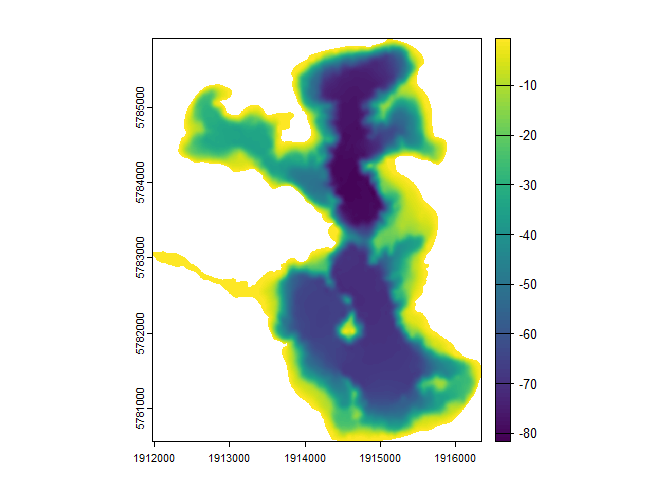

# bathytools

The goal of bathytools is to facilitate the generation of bathymetric
data for lakes and reservoirs. The package provides functions to
rasterise point depth data into a bathymetric raster. The package is
designed to work with data from the AEME project, but can be used with
any bathymetric data.

## Development

This package was developed by [LimnoTrack](http://limnotrack.com/) as
part of the Lake Ecosystem Restoration New Zealand Modelling Platform
(LERNZmp) project. [](http://limnotrack.com/)

## Installation

You can install the development version of bathytools from GitHub with:

``` r
# install.packages("pak")
pak::pak("limnotrack/bathytools")
```

## Example

This is a basic example which shows you how to generate a bathymetric
raster from a shoreline and depth points:

``` r
library(bathytools)
## basic example code
shoreline <- readRDS(system.file("extdata/rotoma_shoreline.rds",
                                 package = "bathytools"))
depth_points <- readRDS(system.file("extdata/depth_points.rds",
                                  package = "bathytools"))
bathy <- rasterise_bathy(shoreline = shoreline, depth_points = depth_points,
                         crs = 2193)
#> Generating depth points... [2025-09-15 12:08:23]
#> Finished! [2025-09-15 12:08:23]
#> Interpolating to raster... [2025-09-15 12:08:23]
#> Adjusting depths >= 0 to  -0.82 m
#> Finished! [2025-09-15 12:08:31]
```


